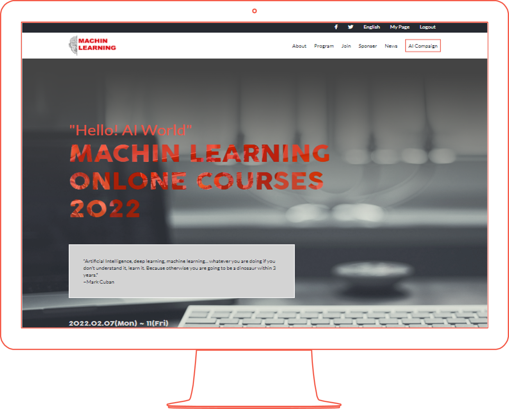
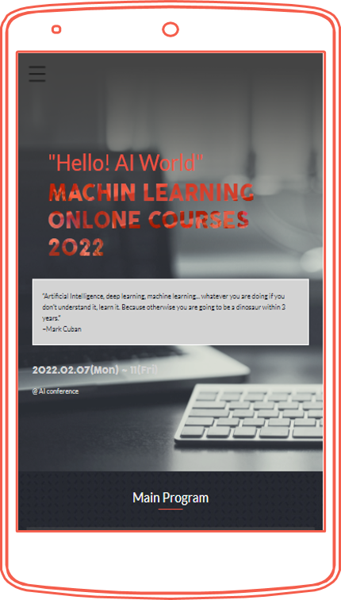

# Machin Learning Onine Course 2022
> This project is template for machin learning online courses event, which is builed from scratch using CSS and JavaScript without using any framework or prebuiled design. A description video of this project can be found at [Link to description of the project video]()


> image1: A screenshot of desktop display of this project


> image2: A screenshot of mobile display of this project

## Built With

- HTML
- CSS
- Javascript

## Features

- Responsive mobile display and desktop desplay design for all screen sizes with one breakpoint at 768px
- Dynamic loading "main program" and "lecturers" section contents on page load.
- User friendly design and user interactions.
- Hamburger mobile menu for navigation in mobile display mood.
- Easy to personalized content.

## Getting Started

To get a local copy of this template and personalize the content you can use :
```
git clone  https://github.com/ZahraArshia/machin-learning-online-courses.git
```
this template is adaptable with all browsers including : Chrome, Firefox , Opera , Safari and IE.

## Live Demo

- [GitHub pages](https://zahraarshia.github.io/machin-learning-online-courses/)
- [Live Demo]()

## 👤 Author
- [GitHub:](https://github.com/zahrArshia)
- [Twitter:](https://twitter.com/zahraarshia)
- [LinkedIn:](https://www.linkedin.com/in/zahra-arshia-89247210a/)

## 🤝 Contributing

Contributions, issues, and feature requests are welcome!

Feel free to check the [issues page](../../issues/).

## 💙 Show your support 

Give a ⭐️ if you like this project!

## 📝 License

This project is [CC](https://github.com/ZahraArshia/machin-learning-online-courses/blob/main/LICENSE.md) licensed.
